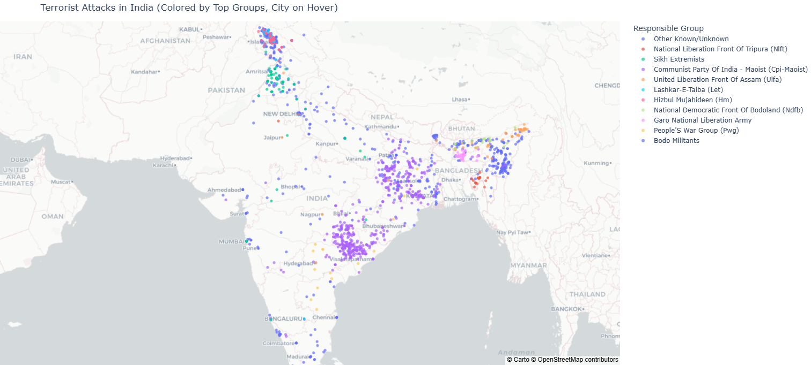

# 🌍 Global Terrorism Analysis & Machine Learning Prediction Project


## 📖 Project Overview

This project performs **Exploratory Data Analysis (EDA)** and **Machine Learning modeling** on the official  
**Global Terrorism Database (GTD)**, covering **289,796 terrorism incidents worldwide (1970–2020)**.

The goal is to:
- Understand **global terrorism patterns**
- Identify **major hotspots**
- Analyze **attack methods and responsible groups**
- Train an ML model to **predict the Terrorist Group responsible** for an attack

Developed by **Ayush Gupte (PRN: 22070521120 | Batch: 2022–26)** under the Machine Learning course module.

---

## 📂 Dataset

| Property | Details |
|---------|---------|
| **Source** | Global Terrorism Database (GTD) |
| **Timeline** | 1970–2020 |
| **Records** | 289,796 incidents |
| **Initial Features** | 135 |
| **Selected Features for ML** | 11 |

### **Final Selected Columns**
```
Year, Month, Country, Region, Latitude, Longitude, 
AttackType, TargetType, WeaponType, Suicide, GroupName
```

---

## 🔍 Exploratory Data Analysis (Main_EDA_3.ipynb)

### **1️⃣ Global Terrorism Trend (1970–2020)**


### **2️⃣ Terrorist Pattern Across Indian Cities**


### **3️⃣ Key Insights**
- Strong rise in attacks **post-2000**, peaking in **2014** (ISIL expansion)
- **Middle East & South Asia** are the most affected regions
- **Bombings/Explosions** are the most common attack method
- **Taliban & ISIL** dominate recent decades
- **Suicide attacks** are <5% but extremely deadly

---

## 🧹 Data Preprocessing (Data_Cleaning_2.ipynb)

- Removed noisy / irrelevant columns
- Handled missing values (Mean/Mode imputation)
- Normalized labeled categories
- Created final cleaned dataset → `Cleaned Dataset/`

---

## 🤖 Machine Learning Model (Main_ML_file.ipynb)

This notebook includes **both EDA + ML Model Development**, including:

| Step | Description |
|------|-------------|
| Label Encoding | Encoded categorical features |
| Train-Test Split | 80/20 |
| Algorithms Used | Random Forest (primary model) |
| Model Output | Classification report & accuracy score |
| Saved Model | `attack_type_label_encoder.pkl` |

---

## 💻 Streamlit Application (app.py)

A **web-based visualization & prediction dashboard** using **Streamlit**.

### Run the App:
```bash
pip install -r requirements.txt
streamlit run app.py
```

---

## 📁 Project Structure

```
├── Original Dataset/
├── Cleaned Dataset/
├── Data_Cleaning_2.ipynb
├── Main_EDA_3.ipynb
├── Main_ML_file.ipynb         # Contains EDA + ML modeling
├── app.py                     # Streamlit dashboard app
├── Global_Terrorism_Incident_Map.png
├── India_cities_with_terrorist_attack.png
├── global_terrorism_map.html  # Interactive geospatial map
├── attack_type_label_encoder.pkl
├── ML_Output_GTD.pdf
└── README.md
```

---

## 🚀 Future Scope

- Implement **XGBoost, LSTM sequence models**
- Add **SHAP-based explainability**
- Host Streamlit app on **Cloud / Heroku / AWS**
- Add **real-time terrorism event monitoring dashboard**

---

## 👤 Author

**Ayush Gupte**  
PRN: 22070521120 | Batch: 2022–26  
GitHub: https://github.com/AyushGupte-22  

---

## 📜 License
This repository is intended strictly for **academic and research use only**.  
Dataset credit: **Global Terrorism Database (GTD)**.
